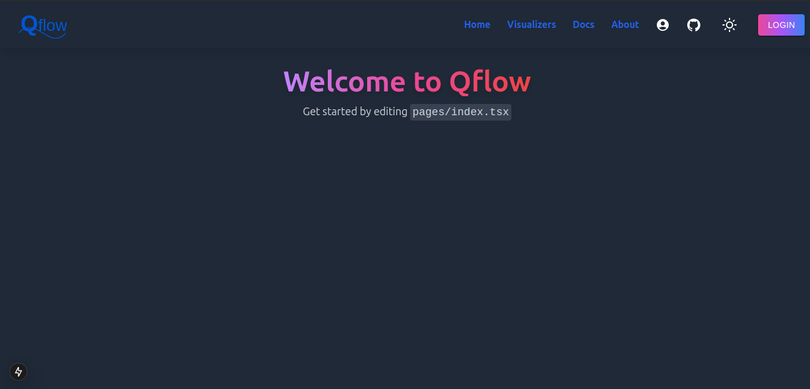
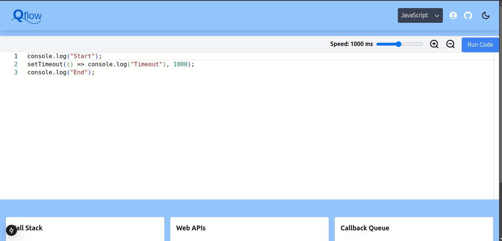
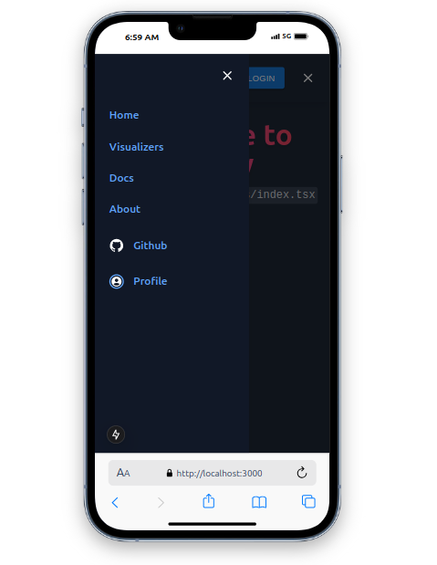
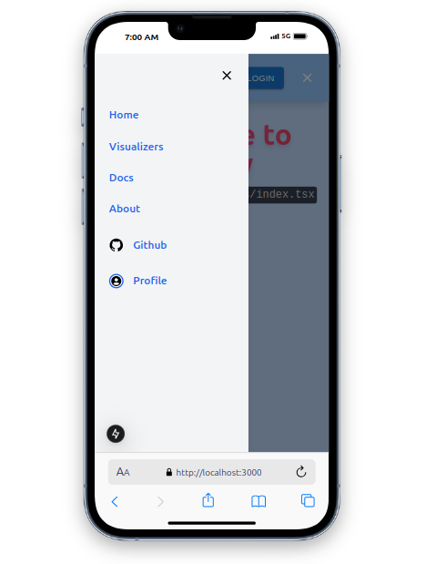

---

# 🌟 **Qflow**  

**An interactive tool to visualize and explore programming concepts with an elegant and modern user interface.**  

---

## 🚀 **Overview**  

Qflow is a **powerful and intuitive platform** designed for developers, students, and enthusiasts to:  
- **Visualize** complex programming concepts in an easy-to-understand way.  
- **Learn** interactively with dynamic tools and guides.  
- **Explore** new technologies and understand their workflows visually.  

Whether you’re a seasoned developer or a beginner, Qflow provides the perfect blend of simplicity and functionality to make learning and debugging enjoyable!  

---

## ✨ **Features**  

- 🌐 **Interactive Visualizers**: Navigate through real-time event loops, state management, and database flows.  
- 🎨 **Sleek Design**: Minimalistic yet vibrant UI built with cutting-edge design frameworks.  
- 🌗 **Dark/Light Mode**: Choose your theme for a personalized experience.  
- 🔒 **Secure Authentication**: User-friendly login and sign-up system with OAuth support for Google and GitHub.  
- 📚 **Docs & Guides**: Built-in documentation for effortless onboarding.  
- 🛠️ **Built for Developers**: Open-source and customizable for various use cases.  

---

## 🛠 **Tech Stack**  

Qflow is powered by a modern tech stack for scalability and performance:  

- **Frontend**: ReactJS, TypeScript, NextJS, TailwindCSS, Material-UI  
- **Backend**: NodeJS, ExpressJS, Prisma ORM  
- **Database**: NeonDB (PostgreSQL)  
- **Authentication**: Auth.js (OAuth 2.0)  
- **UI Enhancements**: Zod, GSAP, Three.js  

---

## 🚧 **Setup and Installation**  

Follow these steps to run Qflow locally:  

### 1️⃣ Prerequisites  
Ensure you have the following installed:  
- [Node.js](https://nodejs.org/)  
- [npm](https://www.npmjs.com/) or [yarn](https://yarnpkg.com/)  

### 2️⃣ Clone the Repository  
```bash  
git clone https://github.com/annuk123/Qflow.git  
cd Qflow  
```  

### 3️⃣ Install Dependencies  
```bash  
npm install  
# or  
yarn install  
```  

### 4️⃣ Configure Environment Variables  
Create a `.env.local` file in the root directory and add the following:  
```env  
DATABASE_URL=<Your Database Connection URL>  
NEXTAUTH_URL=<Your App URL>  
GOOGLE_CLIENT_ID=<Google OAuth Client ID>  
GOOGLE_CLIENT_SECRET=<Google OAuth Client Secret>  
GITHUB_CLIENT_ID=<GitHub OAuth Client ID>  
GITHUB_CLIENT_SECRET=<GitHub OAuth Client Secret>  
```  

### 5️⃣ Start the Development Server  
```bash  
npm run dev  
# or  
yarn dev  
```  
Your app will be running at [http://localhost:3000](http://localhost:3000).  

---

## 🌐 **Deploying to Vercel**  

You can deploy Qflow seamlessly on [Vercel](https://vercel.com/):  
1. Push your code to GitHub.  
2. Import the project into your Vercel dashboard.  
3. Add the environment variables in the Vercel settings.  
4. Deploy with one click!  

---

## 📸 **Screenshots**  

### 💻 Home Page  
  

### 🎨 Visualizers  
  


---

## 🤝 **Contributing**  

Contributions are welcome! To get started:  
1. Fork this repository.  
2. Create a new branch: `git checkout -b feature-xyz`.  
3. Commit your changes: `git commit -m "Add feature xyz"`.  
4. Push to the branch: `git push origin feature-xyz`.  
5. Open a pull request.  

---

## 📜 **License**  

This project is licensed under the [MIT License](./LICENSE).  

---

## 🙌 **Acknowledgments**  

A huge thanks to the open-source community and libraries that made this project possible!  

--- 

**Happy Coding! 💻✨**  
